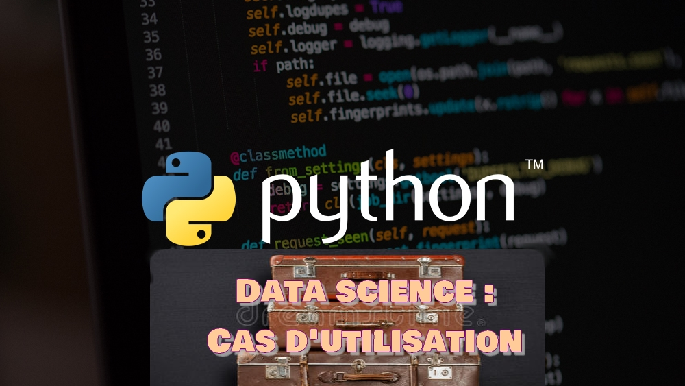

# PYTHON DATA SCIENCE SCRIPTS EN FRANCAIS
<b>CAS D'UTILISATIONS .</b>
 
 
## English
Just Some ordered python regressions and linear solvers studies scripts...

## Books
https://www.amazon.fr/Python-Data-Science-Dummies-Mueller/dp/1119547628
Python Data Science Handbook 
https://jakevdp.github.io/PythonDataScienceHandbook/

## Info 
Files with the C letter at the start of their names have confirmed status.  
Files with the KO letters at the beginning of their names have a result to check or fail.

<b>Français/French</b> 

## Intro 
Je stocke ici divers scripts de data science et de mathématiques descriptives ou prédictives en Python. 

## Dernières news du dépot : 
- Super lien pour les équations différentielles https://apmonitor.com/pdc/index.php/Main/PhysicsBasedModels

## Infos : 
<b>Les scripts possédant la lettre C au début de leur noms ont un statut confirmé.</b> 
<b>Les scripts possédant l'attribut BASE au début de leurs noms sont les plus simples et fiables.</b> 
<b>Les scripts possédant la lettre KO au début de leurs noms ont un statut à vérifier ou en défaut.</b>
 
(Note : Confirmé, veut dire résultat bon, confirmé par comparaison, cependant, la méthode/stratégie pour obtenir le resultat n'est pas forcément encore la meilleure.) 
 

## Librairies utilisées
* numpy 
* matplotlib 
* pandas 
* scipy 
* sklearn 
* pulp (Solvers) 
* pyschedule https://github.com/timnon/pyschedule 
* Survival regression https://lifelines.readthedocs.io/en/latest/Survival%20Regression.html#the-dataset-for-regression   

## Datasets et notebooks à télécharger sur Kaggle !
https://www.kaggle.com/notebooks  

## Liens et références

https://www.eyrolles.com/Informatique/Livre/programmation-lineaire-avec-excel-9782212126594/
https://www.springer.com/gp/book/9782287302787
Le site d'un professeur de l'ENSAE: http://www.xavierdupre.fr/app/ensae_teaching_cs/helpsphinx/td_2a.html#machine-learning-les-briques-de-bases 

## Les Chaines Youtube Françaises:
Machine Learnia https://www.youtube.com/channel/UCmpptkXu8iIFe6kfDK5o7VQ 
Clipedia : https://www.youtube.com/channel/UCNwWU1hqK3q-DclufllWCfg 
ProMath : https://www.youtube.com/channel/UC2flwAftkypBx2gLIamxwqg 
Nicolas Br https://www.youtube.com/channel/UCzsU0h6kxkSSCqpXTRUHubg 
Yvan Monka : https://www.youtube.com/user/YMONKA 
Saïd Chermak : https://www.youtube.com/channel/UCppNXkk1sgDguxe8fQK9tng 
Science4All : https://www.youtube.com/watch?v=Jf40Xd52NyQ

<b>Liens et références (Suite)</b> 
A regarder également le super dépot Columbia-Intro-Data-Science avec tout le travail d'étudiants de Columbia dans ce domaine avec Python. 

https://github.com/Columbia-Intro-Data-Science 

Les cours sont ici :  
https://github.com/Columbia-Intro-Data-Science/APMAE4990-/tree/master/notebooks 

Un autre dépot sympa : 
https://github.com/CamDavidsonPilon/Probabilistic-Programming-and-Bayesian-Methods-for-Hackers 

## Ecoles :
1. S'inscrire à l'université de Brest : http://formations.univ-brest.fr/fr/index.html
2. S'inscrire à l'université de Rennes  : https://formations.univ-rennes1.fr/master-1-data-science
3. S'inscrire à l'EICNAM : http://ecole-ingenieur.cnam.fr/hors-temps-de-travail/inscription-a-l-eicnam/
4. S'inscrire à l'ENSAE : https://www.ensae.fr/auditeurs-libres/
5. S'inscrire à L'université de Bordeaux : http://www.math.u-bordeaux.fr/~mchave100p/teaching/ https://www.math.u-bordeaux.fr/imb/spip.php  
6. S'inscrire au D.U de Statistiques à Toulouse : https://www.ut-capitole.fr/formations/se-former-autrement/formation-ouverte-et-a-distance/diplome-universitaire-statistique-appliquee-formation-a-distance--326811.kjsp?RH=1319186952079

## Moocs :
Coursera  
Programmer en Python pour la Data Science de A à Z :https://www.udemy.com/course/data-science-avec-python/ 
Les Data Sciences de A à Z  : https://www.udemy.com/course/les-data-sciences-de-a-a-z/ 
Spécialisation Science des données appliquée avec Python : https://fr.coursera.org/specializations/data-science-python 
Modélisation financière : https://www.coursera.org/specializations/finance-quantitative-modeling-analysts#courses  
real-data-science-problems : https://www.udemy.com/course/real-data-science-problems-with-python/ 
Finances : https://www.my-mooc.com/fr/mooc/python-and-statistics-for-financial-analysis/ 

Tous les cours de programmation linéaire :  
https://www.udemy.com/courses/search/?q=%22LINEAR%20PROGRAMMING%22&src=sac&kw=linear%20programmaing  

Moocs de Maths: 
https://www.fun-mooc.fr/courses/course-v1:MinesTelecom+04008+session06/about  

Moocs de sciences Physique :  
https://www.my-mooc.com/fr/categorie/physique  

##  Collabs : 
Vous désirez collaborer avec moi (Surtout sur les solveurs linéaires ( Monde agricole, productions alimentaires, production et j'espère... finance)) ... Ok ! envoyez moi un message 
